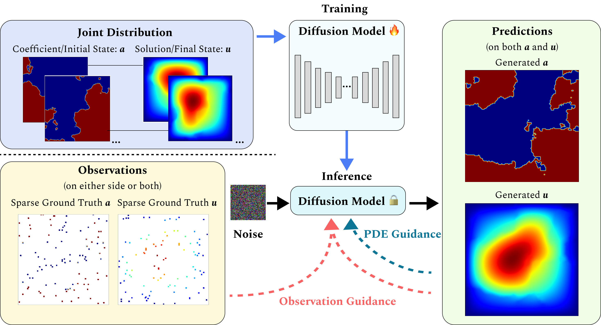

# DiffusionPDE: Generative PDE-Solving Under Partial Observation | NeurIPS 2024

### [Project Page](https://jhhuangchloe.github.io/Diffusion-PDE/) | [Paper](https://arxiv.org/abs/2406.17763)

Official PyTorch implementation.<br>
**DiffusionPDE: Generative PDE-Solving Under Partial Observation**<br>
Jiahe Huang, Guandao Yang, Zichen Wang, Jeong Joon Park<br>
University of Michigan<br>
Stanford University<br>


## Requirements

Python libraries: See [environment.yml](environment.yml) for library dependencies. The conda environment can be set up using these commands:

```.bash
conda env create -f environment.yml -n DiffusionPDE
conda activate DiffusionPDE
```

## Data Generation

All training datasets can be downloaded from [here](https://drive.google.com/file/d/1z4ypsU3JdkAsoY9Px-JSw9RS2f5StNv5/view?usp=sharing) and all test datasets can be downloaded from [here](https://drive.google.com/file/d/1HdkeCKMLvDN_keIBTijOFYrRcA3Quy0l/view?usp=sharing). Unzip the ``training.zip`` folder and the ``testing.zip`` folder in the ``data/`` directory. You can also directly access data files [here](https://drive.google.com/drive/folders/1YbTCcBE6HlUuYNGuf2QVGfbmfTOi3_My?usp=sharing).

Datasets of Darcy Flow, Poisson equation, and Helmholtz equation are of the shape [N, X, Y], where N is the number of instances, and X, Y are spatial resolutions. Datasets of non-bounded and bounded Navier-Stokes equation are of the shape [N, X, Y, T] where T is the number of time steps. Datasets of Burgers' equation are of the shape [N, X, T].

Data generation codes for bounded Navier Stokes equation are derived from [2D Fliud Simulator](https://github.com/takah29/2d-fluid-simulator), and codes for other PDEs are available in the ``dataset_generation`` folder. Specifically, we implemented our data generation over [FNO](https://neuraloperator.github.io/neuraloperator/dev/index.html) and modified the code to introduce more finite difference methods for the Poisson equation and the Helmholtz equation.

## Train Diffusion Models

All pre-trained models can be downloaded from [here](https://drive.google.com/file/d/1w4V0o-nTjpHP_Xv32Rt_SgPGmVa9PwL_/view?usp=sharing). Unzip the ``pretrained-models.zip`` in the root directory.

Our training script is derived from [EDM](https://github.com/NVlabs/edm). To train a new diffusion model on the joint distribution, use, e.g.,

```python

python3 merge_data_TE_heat.py # TE_heat

# Train the diffusion model.
# TE_heat
CUDA_VISIBLE_DEVICES=0,1,2,3,4,5,6 torchrun --standalone --nproc_per_node=7 train.py --outdir=pretrained-TE_heat/ --data=data/TE_heat-merged/ --cond=0 --arch=ddpmpp --batch=84 --batch-gpu=12 --tick=10 --snap=50 --dump=100 --duration=10 --ema=0.05

# NS_heat
CUDA_VISIBLE_DEVICES=2,3,4,5,6,7 torchrun --standalone --nproc_per_node=6 train.py --outdir=pretrained-NS_heat/ --data=data/NS_heat-merged/ --cond=0 --arch=ddpmpp --batch=72 --batch-gpu=12 --tick=10 --snap=50 --dump=100 --duration=10 --ema=0.05

# MHD
CUDA_VISIBLE_DEVICES=0,1,2,3,4,5,6 torchrun --standalone --nproc_per_node=7 train.py --outdir=pretrained-MHD/ --data=data/MHD-merged/ --cond=0 --arch=ddpmpp --batch=84 --batch-gpu=12 --tick=10 --snap=50 --dump=100 --duration=10 --ema=0.05

# E_flow
CUDA_VISIBLE_DEVICES=0,1,2,3,4,5,6 torchrun --standalone --nproc_per_node=7 train.py --outdir=pretrained-E_flow/ --data=data/E_flow-merged/ --cond=0 --arch=ddpmpp --batch=84 --batch-gpu=12 --tick=10 --snap=50 --dump=100 --duration=10 --ema=0.05

# VA
CUDA_VISIBLE_DEVICES=2,3,4,5,6,7 torchrun --standalone --nproc_per_node=6 train.py --outdir=pretrained-VA/ --data=data/VA-merged/ --cond=0 --arch=ddpmpp --batch=72 --batch-gpu=12 --tick=10 --snap=50 --dump=100 --duration=10 --ema=0.05

# Elder
CUDA_VISIBLE_DEVICES=2,3,4,5,6,7 torchrun --standalone --nproc_per_node=6 train.py --outdir=pretrained-Elder/ --data=data/Elder-merged/ --cond=0 --arch=ddpmpp --batch=72 --batch-gpu=12 --tick=10 --snap=50 --dump=100 --duration=10 --ema=0.05

## Solve Forward Problem

To solve the forward problem with sparse observation on the coefficient (or initial state) space, use, e.g.,
# TE_heat
CUDA_VISIBLE_DEVICES=7 python3 generate_pde.py --config configs/TE_heat.yaml
```
# NS_heat
CUDA_VISIBLE_DEVICES=5 python3 generate_pde.py --config configs/NS_heat.yaml

# MHD
CUDA_VISIBLE_DEVICES=5 python3 generate_pde.py --config configs/MHD.yaml

# E_flow
CUDA_VISIBLE_DEVICES=5 python3 generate_pde.py --config configs/E_flow.yaml

# VA
CUDA_VISIBLE_DEVICES=1 python3 generate_pde.py --config configs/VA.yaml


# Elder
CUDA_VISIBLE_DEVICES=7 python3 generate_pde.py --config configs/Elder.yaml
